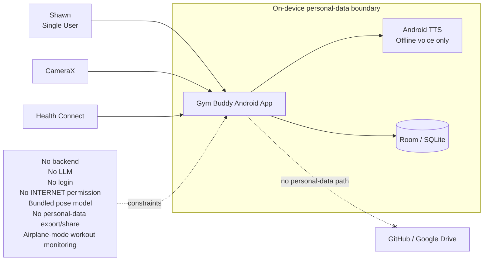
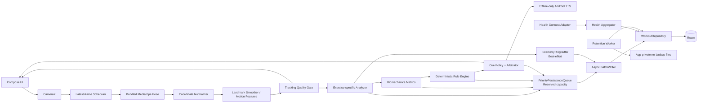
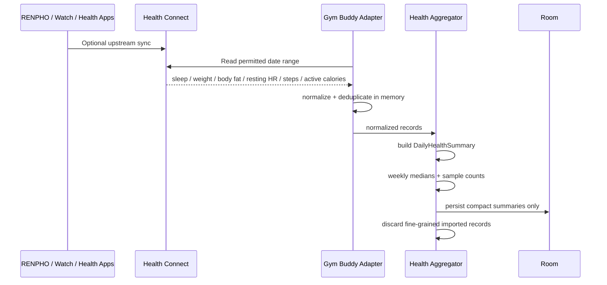
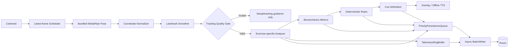
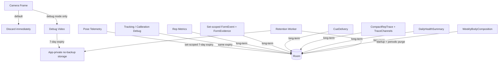

# Gym Buddy UML Overview v0.7

Final architecture review candidate for a single-user, local-first Android biomechanics coach.

## 1. System Context



Real Gym Buddy personal data stays on the Android device.

## 2. Android Component Architecture



`PriorityPersistenceQueue` prioritizes records but is not itself durable; durability begins after Room commit.

## 3. Domain / Data Model

```mermaid
classDiagram
    class UserProfile {
      +heightCm
      +preferredUnits
      +activeTrainingPlanId
      +activeTrainingPlanVersion
    }
    class TrainingPlan { +id +name +version }
    class TrainingDay { +dayOfWeek +displayName +order }
    class PlannedExercise { +exerciseId +order +notes }
    class PlannedSet {
      +setNumber
      +targetLoadPct
      +loadPercentBasis
      +repsMin
      +repsMax
      +rirMin
      +rirMax
    }
    class ExerciseDefinition { +id +displayName +analyzerType +defaultCameraView }
    class CalibrationProfile { +exerciseId +version +cameraView +createdAt }
    class DailyContext { +date +caloriesKcal +proteinG +carbsG +fatG +preWorkoutCarbsG +waterMl +sodiumMg }
    class DailyHealthSummary { +date +sleepMinutes +sleepQuality +restingHeartRateBpm +steps +activeCaloriesKcal +sourceSummary }
    class WeeklyBodyComposition { +weekStart +medianWeightKg +weightSampleCount +medianBodyFatPct +bodyFatSampleCount +sourceSummary }
    class WorkoutSession { +startedAt +endedAt +trainingPlanId +trainingPlanVersion +appBuild +poseModelVersion }
    class ExerciseExecution { +exerciseId +plannedExerciseId +order +analyzerVersion +metricVersion +calibrationVersion }
    class ExerciseSet { +plannedSetId +setNumber +loadKg +targetReps +startedAt +endedAt +telemetryExpiresAt }
    class Rep { +repNumber +startedAtElapsedNanos +endedAtElapsedNanos +completionState }
    class TelemetrySample { +elapsedRealtimeNanos +repId nullable +phase nullable +landmarks +trackingConfidence }
    class TrackingEvent { +elapsedRealtimeNanos +type +severity }
    class RepMetric { +metricType +value +unit +confidence +metricVersion }
    class FormEvent { +id +repId nullable +ruleId +ruleVersion +severity +confidence +startedAtElapsedNanos +endedAtElapsedNanos }
    class FormEvidence { +key +observedValue +unit +comparator +thresholdValue +textValue }
    class CueDelivery { +deliveredAtElapsedNanos +channel +message }
    class CompactRepTrace { +traceVersion +schemaId +pointCount +normalizedTime }
    class TraceChannel { +name +unit +side +values }

    UserProfile "1" --> "many" TrainingPlan
    TrainingPlan "1" --> "many" TrainingDay
    TrainingDay "1" --> "many" PlannedExercise
    PlannedExercise "1" --> "many" PlannedSet
    PlannedExercise "many" --> "1" ExerciseDefinition
    UserProfile "1" --> "many" CalibrationProfile
    UserProfile "1" --> "many" DailyContext
    UserProfile "1" --> "many" DailyHealthSummary
    UserProfile "1" --> "many" WeeklyBodyComposition
    UserProfile "1" --> "many" WorkoutSession
    WorkoutSession "1" --> "many" ExerciseExecution
    ExerciseExecution "many" --> "1" ExerciseDefinition
    ExerciseExecution "1" --> "many" ExerciseSet
    ExerciseSet "1" --> "many" Rep
    ExerciseSet "1" --> "many" TelemetrySample
    ExerciseSet "1" --> "many" TrackingEvent
    ExerciseSet "1" --> "many" FormEvent
    Rep "0..1" <-- "many" TelemetrySample
    Rep "0..1" <-- "many" FormEvent
    Rep "1" --> "many" RepMetric
    FormEvent "1" --> "many" FormEvidence
    FormEvent "1" --> "many" CueDelivery
    Rep "1" --> "0..1" CompactRepTrace
    CompactRepTrace "1" --> "many" TraceChannel
    WorkoutSession "many" --> "0..1" DailyContext
    WorkoutSession "many" --> "0..1" DailyHealthSummary
```



Key points: `FormEvent` is set-scoped with optional `repId`; `telemetryExpiresAt` is non-null from set creation; `CompactRepTrace` is generic; `loadPercentBasis` is nullable rather than guessed.

## 4. Live Workout Analysis Sequence

```mermaid
sequenceDiagram
    participant U as User
    participant C as CameraX
    participant F as Frame Scheduler
    participant P as MediaPipe
    participant N as Normalize + Smooth
    participant G as Quality Gate
    participant A as Exercise Analyzer
    participant R as Rules
    participant Q as Cue Arbitrator
    participant T as Telemetry Queue
    participant X as Priority Persistence Queue
    participant W as BatchWriter
    participant DB as Room

    U->>DB: Create set; fail-safe expiry = start + 7 days
    U->>C: Start selected exercise set
    loop realtime
      C->>F: frame + monotonic timestamp
      F->>P: newest eligible frame
      P-->>N: landmarks + confidence
      N-->>G: canonical MovementFrame
      alt tracking invalid
        G-->>U: setup / visibility guidance
      else valid
        G-->>A: valid MovementFrame
        A->>A: update rep state + metrics
        A->>R: metrics + phase + history
        R-->>Q: set-scoped FormEvent + structured FormEvidence
        R-->>X: persist detected issue + evidence
        alt cue selected
          Q-->>U: one prioritized visual / offline-TTS cue
          Q-->>X: CueDelivery
        end
        A-->>T: best-effort raw telemetry
        opt rep completed
          A-->>X: rep summary + CompactRepTrace + final metrics
        end
      end
    end
    loop async priority persistence
      X->>W: priority batch first
      W->>DB: transaction
    end
    loop async telemetry persistence
      T->>W: telemetry batch
      W->>DB: transaction
    end
    U->>DB: Close set; expiry = end + 7 days
```

## 5. Health Connect Sequence



## 6. Realtime Processing Pipeline



## 7. Persistence / Data Lifecycle



Retention fail-safe: initialize `telemetryExpiresAt = startedAt + 7 days`; on normal close update to `endedAt + 7 days`. A crash cannot create immortal short-lived telemetry.

## MVP Scope

First exercise: **Incline Dumbbell Press**.

```text
CameraX -> latest-frame scheduler -> bundled MediaPipe Pose
-> coordinate normalization -> smoothing -> quality gate
-> InclineDumbbellPressAnalyzer -> metrics -> deterministic rules
-> cue arbitration -> overlay / offline-only TTS

raw telemetry -> TelemetryRingBuffer
higher-value records -> PriorityPersistenceQueue
both -> async BatchWriter -> Room
```

## Architectural Invariants

- Real personal data stays on the Android device only.
- No backend, LLM, login, INTERNET permission, cloud path, or personal-data export/share in MVP.
- Pose model bundled in APK; Android cloud backup disabled.
- Offline TTS voice only; visual fallback otherwise.
- Tracking quality can veto analysis.
- Detection, evidence and cue delivery are separately observable.
- Form events may exist without a recognized rep.
- Persistence cannot block realtime coaching.
- Priority queue is not itself durable; Room commit is the durability boundary.
- 7-day short-lived data always has a non-null expiry anchor.
- Weight/body-fat is weekly, not daily.
- GitHub and Google Drive never contain real Gym Buddy personal data.
