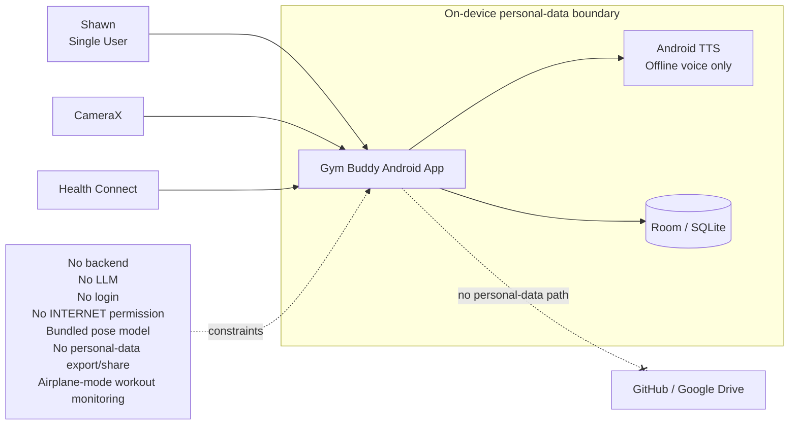
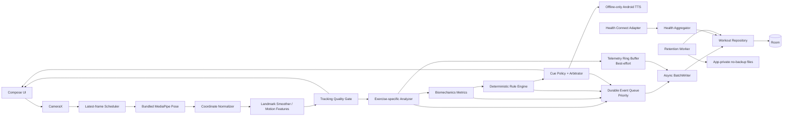
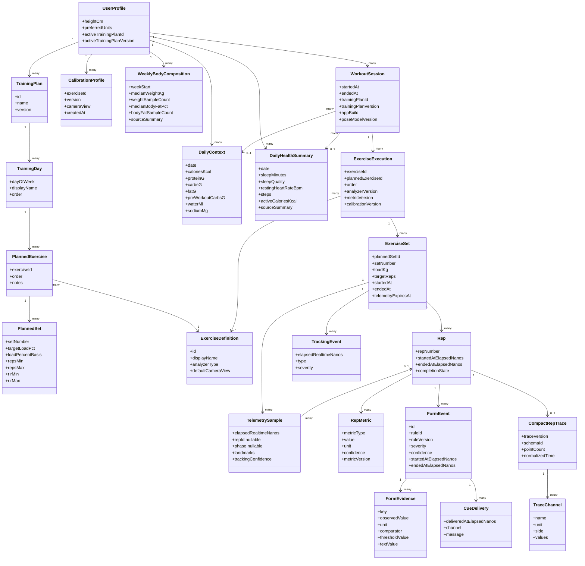
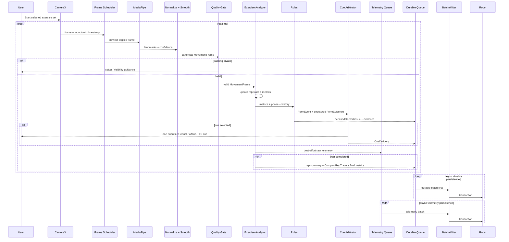
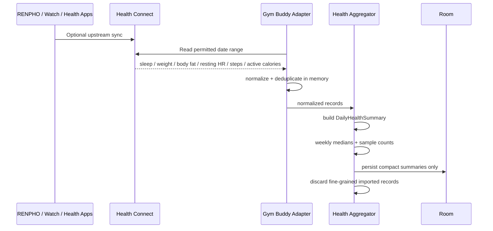
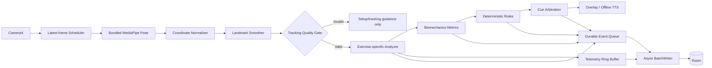
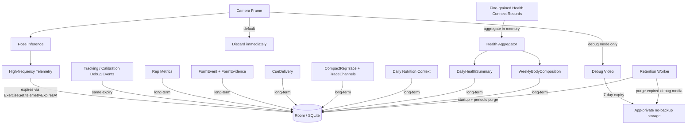

# Gym Buddy UML Overview v0.6

Final architecture review candidate for a single-user, local-first Android biomechanics coach.

## 1. System Context



Real Gym Buddy personal data stays on the Android device. TTS uses only a locally installed non-network voice; otherwise cues are visual-only.

## 2. Android Component Architecture



**Key rules:** stale frames are dropped; invalid tracking blocks analysis; storage is off the realtime path; durable records use a separate priority lane; retention cleanup runs at startup and periodically.

## 3. Domain / Data Model



`PlannedSet` can preserve load %, rep and RIR prescriptions without guessing the percentage basis. `FormEvent` means detected issue; `FormEvidence[]` contains structured evidence; `CueDelivery` exists only for feedback actually delivered. `ExerciseSet.telemetryExpiresAt` anchors 7-day short-lived data cleanup.

## 4. Live Workout Analysis Sequence



Detection and delivery are distinct. The realtime path never waits for Room.

## 5. Health Connect Sequence



Health Connect is optional and never blocks workout monitoring.

## 6. Realtime Processing Pipeline



Backpressure exists independently at camera ingestion and storage. Durable rep/evidence/cue records are prioritized over raw telemetry.

## 7. Persistence / Data Lifecycle



### Retention policy

| Data | Retention |
|---|---|
| Raw camera frame | discard immediately |
| High-frequency pose/movement telemetry | expires 7 days after set close |
| Tracking/calibration debug events | same 7-day set expiry |
| Debug video | OFF by default; 7-day expiry |
| CompactRepTrace + TraceChannel[] | long-term |
| Rep metrics / FormEvent / FormEvidence / CueDelivery | long-term |
| Set/workout summaries | long-term |
| Daily nutrition / DailyHealthSummary | long-term when present |
| Weight/body fat | weekly medians + sample counts |
| Fine-grained Health Connect records | aggregate in memory; not durable |

Expired data is excluded from normal reads once its expiry passes; local startup/periodic cleanup physically purges it.

## MVP Scope

First exercise: **Incline Dumbbell Press**.

```text
CameraX
-> latest-frame scheduler
-> bundled MediaPipe Pose
-> coordinate normalization
-> landmark smoothing
-> tracking quality gate
-> InclineDumbbellPressAnalyzer
-> biomechanics metrics
-> deterministic rules
-> cue arbitration
-> overlay / offline-only TTS

persistence:
raw telemetry -> TelemetryRingBuffer
rep summary / CompactRepTrace / final metrics / FormEvent+FormEvidence / CueDelivery -> DurableEventQueue
both -> async BatchWriter -> Room
```

## Architectural Invariants

- Android only, one user.
- Real personal data stays on the Android device only.
- No backend, LLM, login, INTERNET permission, cloud path, or personal-data export/share in MVP.
- Pose model bundled in APK.
- Android cloud backup disabled.
- Debug media stays app-private/no-backup and expires after 7 days.
- Offline TTS voice only; visual fallback otherwise.
- ML is perception only; reasoning is deterministic code.
- Tracking quality can veto analysis.
- Exercise analyzers own exercise-specific state machines.
- Detection, evidence and cue delivery are separately observable.
- Persistence cannot block realtime coaching.
- Retention cleanup is explicit and enforced.
- Raw/high-frequency data has a 7-day window; compact history remains.
- Weight/body-fat is weekly, not daily.
- GitHub and Google Drive never contain real Gym Buddy personal data.
