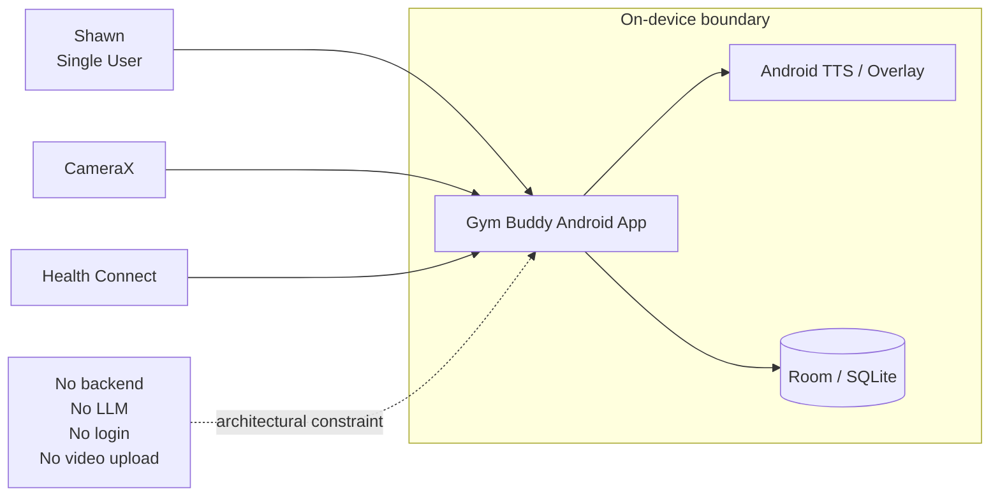
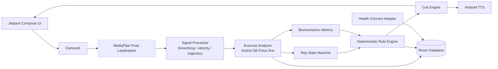
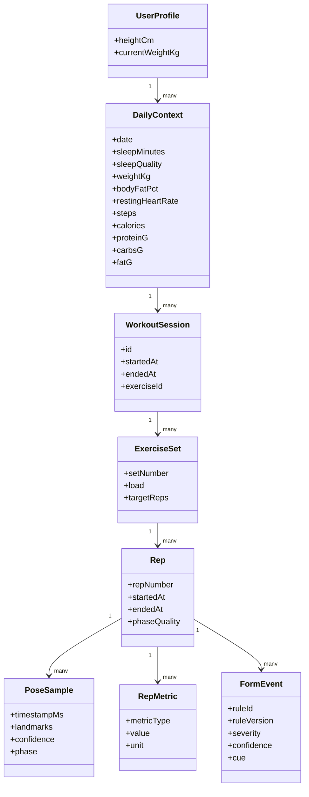
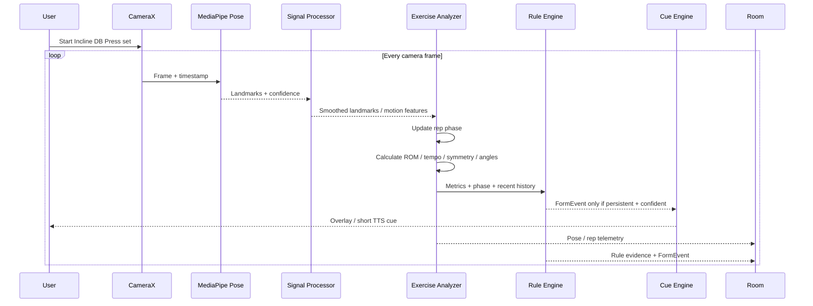
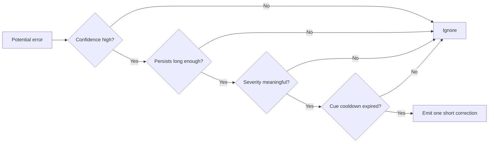
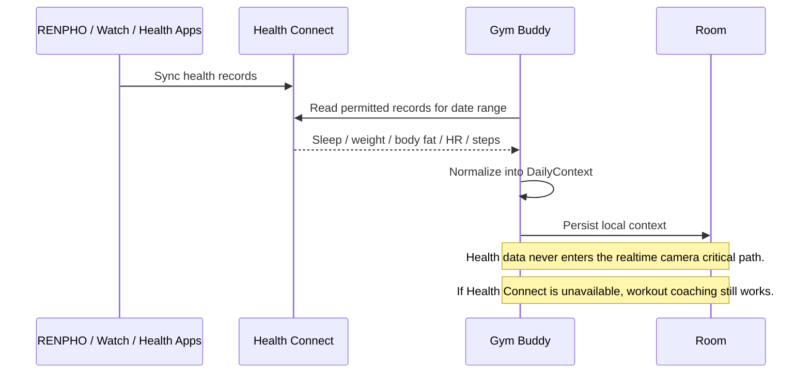

# Gym Buddy UML Overview

This page renders directly on GitHub using Mermaid.

## 1. System Context



## 2. Android Component Architecture



**Rule:** ML is used for perception only. Movement reasoning and coaching decisions are deterministic Kotlin code.

## 3. Domain / Data Model



## 4. Live Workout Analysis Sequence



### Realtime cue gate



## 5. Health Connect Sequence



## MVP Scope

The first exercise is **Incline Dumbbell Press**. The first implementation must prove:

```text
CameraX
-> MediaPipe Pose
-> landmark smoothing
-> rep phase state machine
-> biomechanics metrics
-> deterministic form rules
-> overlay / TTS
-> Room persistence
```

Initial form/quality signals:

- rep count
- eccentric / bottom / concentric / lockout phase
- ROM
- rep tempo
- left/right symmetry
- forearm orientation
- wrist-path / lateral-drift proxy
- confidence and persistence gating for cues

## Architectural Invariants

- Android only.
- One user.
- Local-first and airplane-mode capable.
- No backend required.
- No LLM required.
- No login.
- No video upload.
- Exercise selection is manual.
- Raw video is not persisted by default.
- Structured movement telemetry is the source of truth.
- Personal health/workout recordings do not belong in GitHub; only synthetic/anonymized fixtures may be committed.
