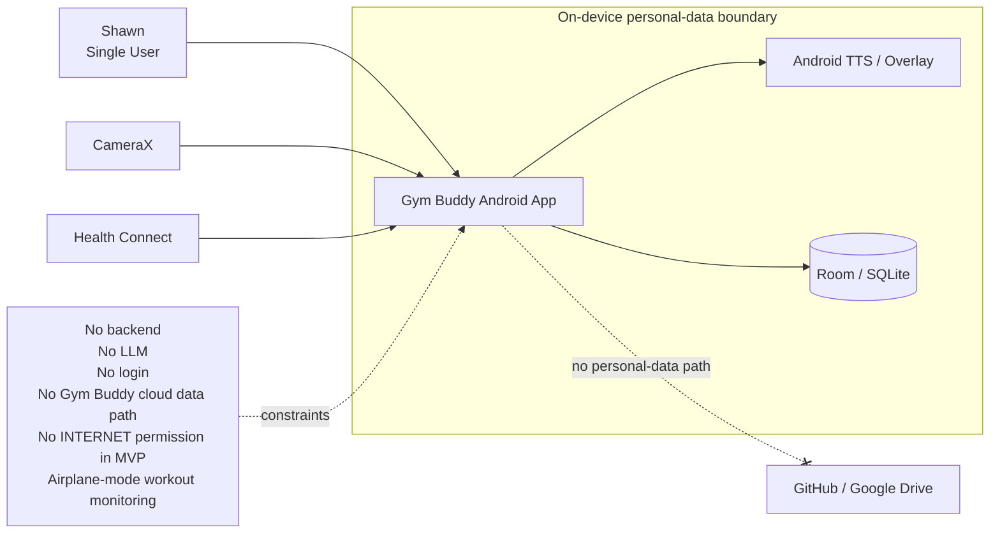
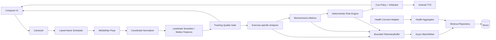
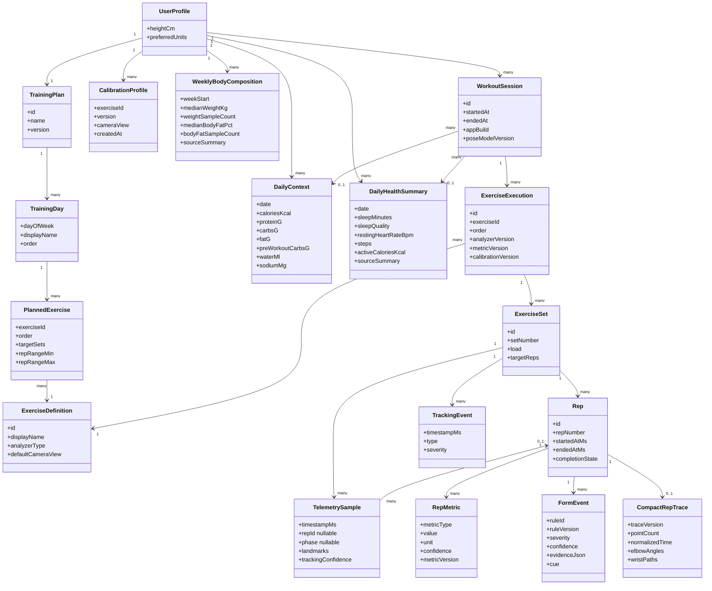
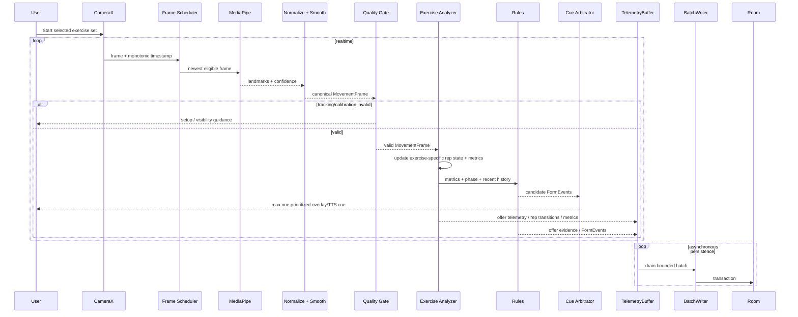
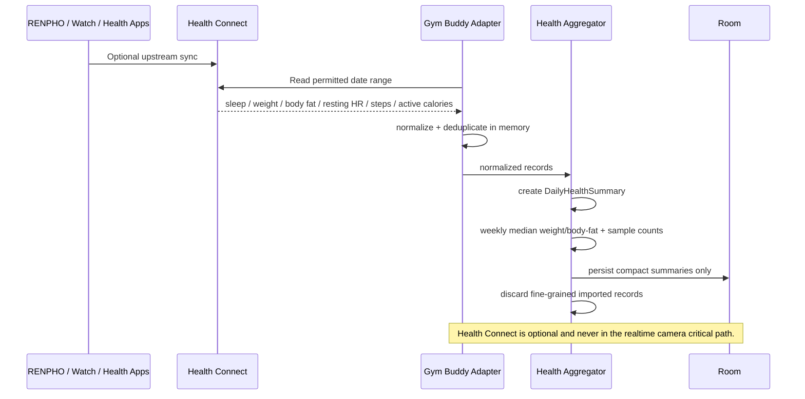
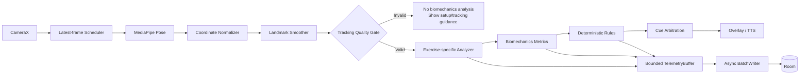
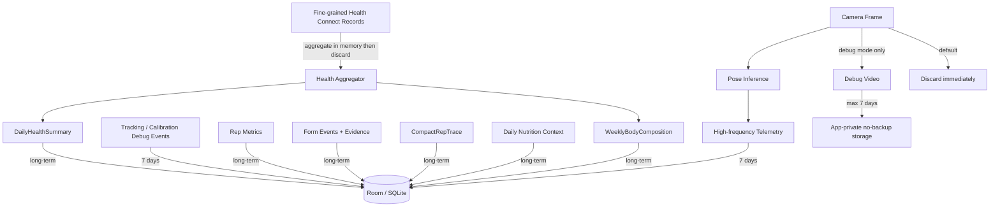

# Gym Buddy UML Overview v0.4

Post-review architecture candidate for a single-user, local-first Android biomechanics coach.

## 1. System Context



Real Gym Buddy personal data stays on the Android device. GitHub contains code/tests/synthetic fixtures; Google Drive contains specs/reports/builds without real telemetry or health records.

## 2. Android Component Architecture



**Key rules:** ML stops at pose perception. Stale camera frames are dropped instead of queued. Invalid tracking/calibration blocks biomechanics analysis and coaching cues. Storage is off the realtime critical path. If persistence falls behind, drop raw telemetry before delaying coaching or losing durable rep/event summaries.

## 3. Domain / Data Model



A workout may contain many exercises. Exercise-specific analyzer/calibration versions belong to `ExerciseExecution`. Full telemetry is short-lived; `CompactRepTrace` is the small long-term movement artifact.

## 4. Live Workout Analysis Sequence



Persistence never blocks coaching. The buffer is bounded; under pressure, raw telemetry is dropped before durable summaries/events.

## 5. Health Connect Sequence



## 6. Realtime Processing Pipeline



Normalization owns rotation, mirroring, left/right body identity, coordinate space, timestamps and units. Backpressure is bounded at both camera ingestion and storage. Neither stale frames nor database writes may accumulate into realtime latency.

## 7. Persistence / Data Lifecycle



### Retention policy

| Data | Retention |
|---|---|
| Raw camera frame | discard immediately |
| High-frequency pose/movement telemetry | 7 days |
| Tracking/calibration debug events | 7 days |
| Debug video | OFF by default; max 7 days if enabled |
| CompactRepTrace | long-term |
| Rep metrics / form events / rule evidence | long-term |
| Set/workout summaries | long-term |
| Daily nutrition / DailyHealthSummary | long-term when present |
| Weight/body fat | one weekly snapshot; prefer medians + sample counts |
| Fine-grained Health Connect records | aggregate in memory; do not persist long-term |

Full-fidelity historical re-analysis is available only inside the 7-day telemetry window. After that, old sessions support compact-trace/metric-level reinterpretation, not reconstruction of every original landmark frame.

Android cloud backup of Gym Buddy personal data must be disabled. Debug media stays in app-private/no-backup storage unless explicitly exported by the user.

## MVP Scope

First exercise: **Incline Dumbbell Press**.

```text
CameraX
-> latest-frame scheduler
-> MediaPipe Pose
-> coordinate normalization
-> landmark smoothing
-> tracking quality gate
-> InclineDumbbellPressAnalyzer
-> biomechanics metrics
-> deterministic rules
-> cue arbitration
-> overlay/TTS

side path:
analysis outputs
-> bounded TelemetryBuffer
-> asynchronous BatchWriter
-> Room
```

Initial signals: rep count; exercise-specific phases; ROM; tempo; left/right symmetry; joint/forearm orientation; wrist-path/lateral-drift proxy; tracking confidence; rule evidence.

## Architectural Invariants

- Android only, one user.
- Real personal data stays on the Android device only.
- Local-first and airplane-mode capable for workout monitoring.
- No backend, LLM, login, or Gym Buddy cloud data path.
- MVP SHALL NOT request `android.permission.INTERNET`.
- Android backup/cloud backup of Gym Buddy personal data is disabled.
- Debug media remains app-private/no-backup unless explicitly exported.
- Exercise selection is manual.
- ML is perception only; reasoning is deterministic code.
- Tracking quality can veto analysis.
- Exercise analyzers own exercise-specific state machines.
- Cue arbitration prevents voice spam.
- Persistence cannot block the realtime coaching path.
- Raw/high-frequency debugging data has a 7-day window; compact historical data is retained long-term.
- Weight/body-fat is stored weekly, not daily.
- GitHub and Google Drive never contain real Gym Buddy personal data.
