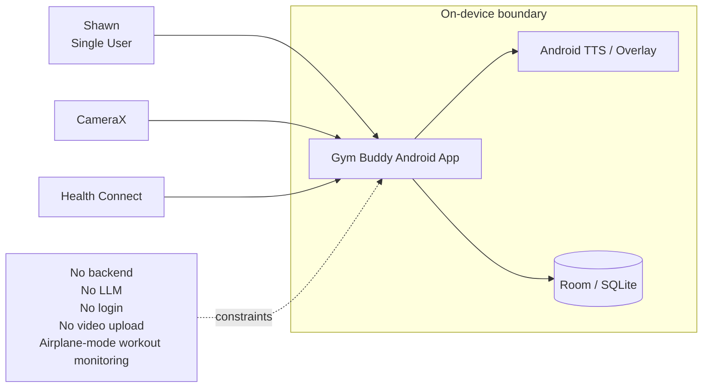
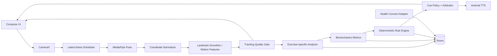
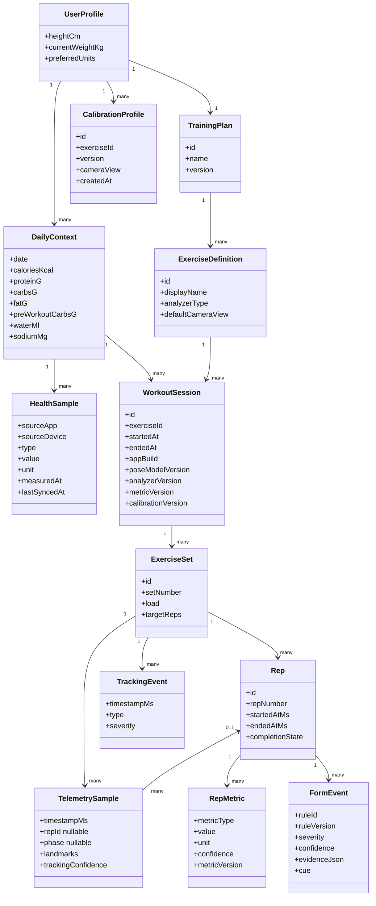
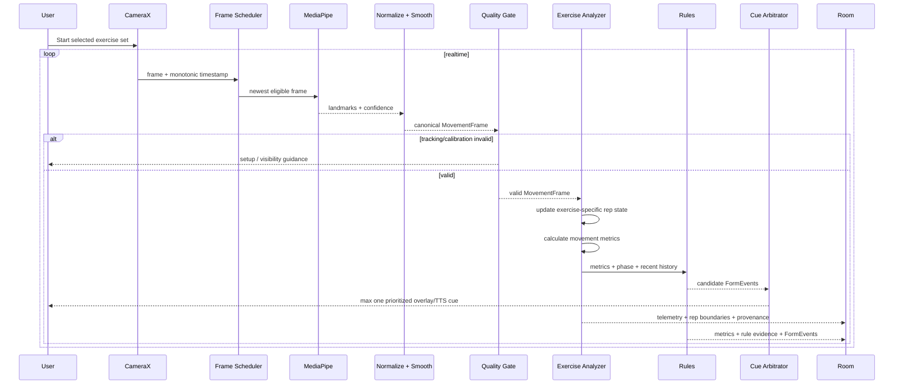
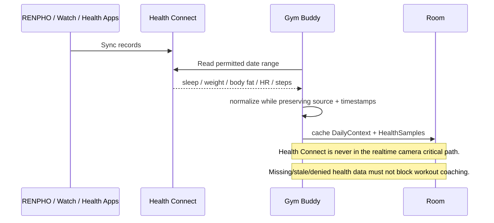
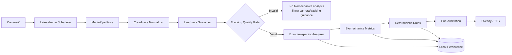
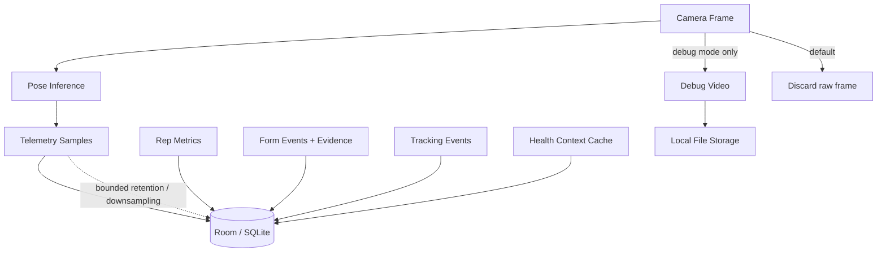

# Gym Buddy UML Overview v0.2

Pre-implementation architecture baseline for a single-user, local-first Android biomechanics coach.

## 1. System Context



## 2. Android Component Architecture



**Key rules:** ML stops at pose perception. Stale camera frames are dropped instead of queued. Invalid tracking/calibration blocks biomechanics analysis and coaching cues. Multiple form issues are arbitrated into at most one actionable cue at a time.

## 3. Domain / Data Model



**Important correction:** telemetry belongs to the set and may optionally reference a rep. This preserves setup, between-rep movement, partial/failed reps, and tracking-loss periods.

## 4. Live Workout Analysis Sequence



## 5. Health Connect Sequence



## 6. Realtime Processing Pipeline



Normalization owns rotation, mirroring, left/right body identity, coordinate space, timestamps, and units. Backpressure is bounded: stale frames are dropped to protect realtime latency.

## 7. Persistence / Data Lifecycle



Default retention policy: raw camera frames are discarded; debug video is explicit opt-in only; small rep metrics/form events are long-term; high-frequency telemetry must use bounded retention, downsampling, or compaction.

## MVP Scope

First exercise: **Incline Dumbbell Press**.

```text
CameraX
-> latest-frame scheduler
-> MediaPipe Pose
-> coordinate normalization
-> landmark smoothing
-> tracking quality gate
-> InclineDumbbellPressAnalyzer
-> biomechanics metrics
-> deterministic rules
-> cue arbitration
-> overlay/TTS
-> Room
```

Initial signals: rep count; exercise-specific phases; ROM; tempo; left/right symmetry; joint/forearm orientation; wrist-path/lateral-drift proxy; tracking confidence; rule evidence.

## Architectural Invariants

- Android only, one user.
- Local-first and airplane-mode capable for workout monitoring.
- No backend, LLM, login, or automatic video upload.
- Exercise selection is manual.
- ML is perception only; reasoning is deterministic code.
- Tracking quality can veto analysis.
- Exercise analyzers own exercise-specific state machines.
- Cue arbitration prevents voice spam.
- Telemetry and algorithm provenance are retained so old sessions can be re-analyzed.
- Health samples retain provenance and timestamps.
- Personal data never belongs in GitHub; only synthetic/anonymized fixtures may be committed.
