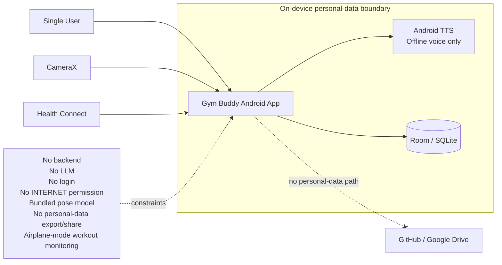
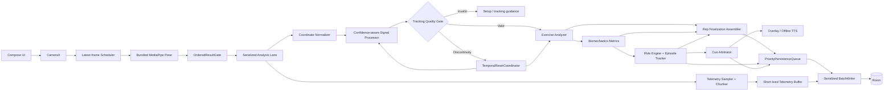
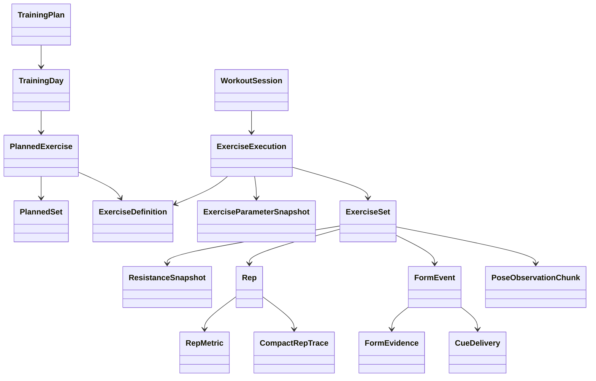
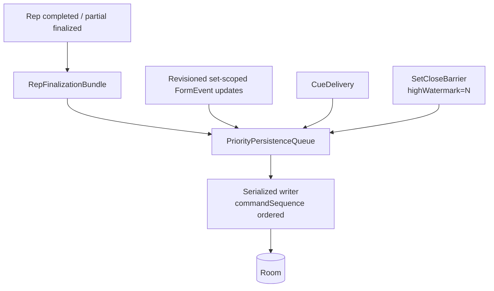
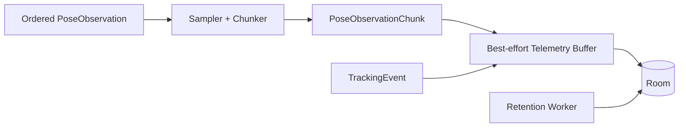

# Gym Buddy UML Overview v0.8

**ARCHITECTURE FROZEN / FINAL.** Final multi-pass review: **P0 = 0, architecture-level P1 = 0**.

## 1. System Context



Real Gym Buddy personal data stays on the Android device.

## 2. Final Realtime Architecture



Key guarantees:
- late/out-of-order inference results are discarded before stateful analysis;
- all stateful biomechanics code runs serially on one temporal lane per active set;
- low-confidence landmarks do not contaminate filter state as valid samples;
- tracking/setup/view discontinuities reset signal/analyzer/metric/trace/rule temporal state together;
- persistence is off the coaching critical path.

## 3. Final Domain Shape



Important semantics:
- plan versions are immutable once referenced;
- `PlannedSet` supports load-percent ranges and nullable basis;
- `ExerciseExecution` snapshots `pipelineVersion`, `analyzerVersion`, `metricVersion`, `ruleSetVersion`, `cuePolicyVersion`, and calibration provenance;
- `ExerciseParameterSnapshot` stores movement configuration such as `benchAngleDeg`;
- `ResistanceSnapshot` preserves semantics such as `PER_HAND`, `MACHINE_STACK`, `ASSISTANCE`, etc.;
- durable realtime timestamps are offsets from the set's monotonic start origin;
- `FormEvent.scope=REP` and `scope=SET` have explicit lifecycle semantics;
- `FormEvent.eventRevision` prevents stale upserts.

## 4. Persistence Correctness



`RepFinalizationBundle` is atomic: Rep + final metrics + optional compact trace + rep-scoped FormEvent finalizations commit in one Room transaction.

`SetCloseBarrier(highWatermark)` is reserved/non-droppable. The UI reports a set saved only after all required priority commands through the high-water mark are durable.

## 5. Short-lived Data



- raw camera frames are discarded immediately;
- pose observations are rate-limited and chunked rather than one Room row per frame;
- pose/debug chunks and tracking events expire with the owning set after 7 days;
- expired rows are excluded from reads immediately and physically purged locally later;
- debug video is OFF by default, app-private/no-backup, max 7 days.

## 6. Health Context

Health Connect remains optional and outside the realtime critical path. Fine-grained imported records are normalized/aggregated in memory, then discarded. Long-term Gym Buddy data is compact:
- `DailyHealthSummary` for daily sleep/activity context;
- `WeeklyBodyComposition` for weekly median weight/body-fat plus sample counts.

Missing/stale/denied Health Connect data never blocks a workout.

## 7. Camera / Tracking State

`08-camera-setup-state.puml` defines setup validation and tracking recovery. A significant tracking gap or material camera/view/setup change is a temporal discontinuity. The interrupted rep is not resumed; temporal state is reset and the app reacquires a fresh stable movement state.

## 8. MVP Rep State Machine

`09-incline-db-press-state-machine.puml` defines:

```text
ACQUIRING_START
-> TOP
-> ECCENTRIC
-> BOTTOM
-> CONCENTRIC
-> REP_COMPLETE
-> TOP
```

Rep recognition uses combined trend evidence, body-local wrist trajectory, velocity reversal, minimum ROM, hysteresis, dwell time, and tracking confidence. It does **not** depend on one universal elbow-angle magic number.

## 9. Retention / Privacy Boundary

- Real personal data: Android device only.
- GitHub: code, architecture, tests, synthetic/anonymized fixtures only.
- Google Drive: specs, architecture, non-personal reports, builds only.
- No `android.permission.INTERNET` in MVP.
- No backend, LLM, account system, personal-data export/share, analytics upload, or cloud backup.
- Offline TTS only; visual fallback otherwise.

## Final Status

**v0.8 is the frozen architecture.** Further decisions belong to SPEC / acceptance criteria / tests / implementation: exact FPS, sampling rate, chunk codec, confidence thresholds, tracking-gap tolerance, state-machine hysteresis/dwell, biomechanics thresholds, cue cooldowns, queue capacity, Room encoding, Health Connect aggregation/timezone rules, and crash-loss tolerance.
